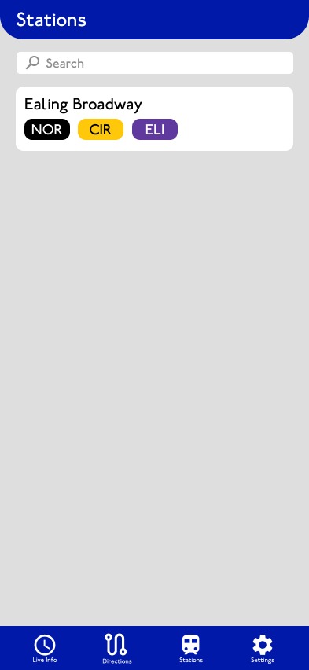

# Development Log

## Day 1 (28-Sep-2025)

Today is main to design the layout of the app. I am using Figma to design it. I have designed some components and the Live Info Page.

### Designs of components

1. Top Bar (Station) 
   .png> "Top Bar Station") 
2. Line Icons 
   
3. Bottom Nav Bar 
   
4. Arrival Items 
   .png> "Delayed with time")
   .png> "Delayed")
   .png> "Scheduled")
   .png> "Normal")

### Designs of Live Info Page

It will only shows the nearest arrival to each destination

.png> "Scheduled")
.png> "Normal")

## Day 2 (29-Sep-2025)

Today, I am continue designing the pages and got all mostly done except the settings page, as I haven't decide what are the settings.
Here is the layout of the pages.

### Design of Train Details Page

This train is to view all the stops and their expected arrival time 

Transfer info shows the nearest train that is possible to interchange at a given time 

### Designs of Route Planner

It allows user to find the direction from A to B, it also allow users to save their routes for later user 

The results page list out possible ways to get to the destination, with possible label for the fastest or fewest interchnages 

The details page shows step by step guidance to get to the destination 

### Designs of Stations page

This page shows all the stations 

The details page show the arrival of trains at that station 

