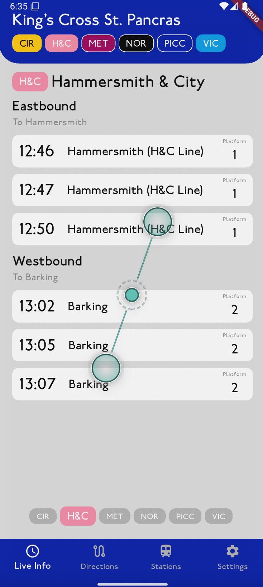

# Development Log

## Day 1 (28-Sep-2025)

Today is main to design the layout of the app. I am using Figma to design it. I have designed some components and the Live Info Page.

### Designs of components

1. Top Bar (Station)<br>
   .png> "Top Bar Station")<br>
2. Line Icons<br>
   
3. Bottom Nav Bar<br>
   
4. Arrival Items<br>
   .png> "Delayed with time")
   .png> "Delayed")
   .png> "Scheduled")
   .png> "Normal")

### Designs of Live Info Page

It will only shows the nearest arrival to each destination

.png> "Scheduled")
.png> "Normal")

## Day 2 (29-Sep-2025)

Today, I am continue designing the pages and got all mostly done except the settings page, as I haven't decide what are the settings.
Here is the layout of the pages.

### Design of Train Details Page

This train is to view all the stops and their expected arrival time<br>


Transfer info shows the nearest train that is possible to interchange at a given time<br>


### Designs of Route Planner

It allows user to find the direction from A to B, it also allow users to save their routes for later user<br>


The results page list out possible ways to get to the destination, with possible label for the fastest or fewest interchnages<br>


The details page shows step by step guidance to get to the destination<br>


### Designs of Stations page

This page shows all the stations<br>


The details page show the arrival of trains at that station<br>


## Day 3

After having a rough design of the app, I started setting up the Flutter project and creating the top bar. I set up the Flutter project using the MVVM structure.

For the font to use, I found the [LondonTube](https://www.fontspace.com/london-tube-font-f2717) which looks similar to the font used in London Tube stations.

Then, I set up the navigation using BottomNavigationBar and created a Top Bar widget to show the information of the current page.

## Day 4

Set up the database storing stations, lines, timetables information in flutter. It is a SQLite Database and is accessed in flutter using [sqflite](https://pub.dev/packages/sqflite).

## Day 5 - 7

In these 3 days, I mainly studying and implementating functions to get the closest station to the user's current location using GPS data. For locating the person, I used the [geolocator](https://pub.dev/packages/geolocator) package.

The following function get the current position of the user.

```dart
Position location = await Geolocator.getCurrentPosition(
   locationSettings: AndroidSettings(
        accuracy: LocationAccuracy.medium,
        accuracy: LocationAccuracy.high,
        distanceFilter: 0,
        timeLimit: Duration(seconds: 10),
        forceLocationManager: true,
      ),
);
```

However, it will sometimes return an old location. After some research, I changed the function to

```dart
await for (Position position in Geolocator.getPositionStream(
      locationSettings: AndroidSettings(
        accuracy: LocationAccuracy.medium,
        accuracy: LocationAccuracy.high,
        distanceFilter: 0,
        timeLimit: Duration(seconds: 10),
        forceLocationManager: true,
      ),
    );
    ) {
      return LatLon(
        position.latitude,
        position.longitude,
      ); // Return the first fresh position
    }
```

it get position periodically but I only get the first result it returns.

After figuring out how to get the current location of user, then I have to find out how to get the nearest station. I already have a database containing the latitude and longitude of all stations. The obvious way is to sort all distances to stations in ascending order and get the first one.

The distance between two locations can be obtained by the [Haversine formula](https://en.wikipedia.org/wiki/Haversine_formula)

Although modern mobile devices should be fast enough to perform the calculation is large amount of stations, the formula contains trigonometric functions and square root, which is computationally expensive to calculate.

I decided to create a bounding box 2 km from the user location to reduce the number of stations to calculate and use the squared euclidean distance ($(\text{lat}_1 - \text{lat}_2)^2 + (\text{lon}_1 - \text{lon}_2)^2$) instead of haversine formula to get a rough distance. This should be much more efficient than calculating the true distance of all station and sorting them.

## Day 8

Created the Arrival Item and Arrival Page.

In order to display different lines of a station. I decided to use swiping gesture to switch between lines.

At first, I tried to use `GestureDetector` along with `onHorizontalPanEnd` to detect the swiping motion of user. It ables to do the job but feel a bit weird when switching between the pages. The just suddening jump from one page to another. I want some animation between swithcing, like reading a eBook.

After some research, I found out that I can use `PageView`, which does exactly what I want without even have to handling the swiping motion detection.

## Day 9

After having the widgets all ready, I start integrate them with the [TfL API](https://api.tfl.gov.uk/). It contains many useful real time data for the London Tube.

### Direction of Travel

One of the feature I want is the seperate the trains into direction (e.g. Westbound and EastBound). The respone of the TfL API does includes the direction in the format of inbound and outbound. However, not all response item include this information.

My initial thought was to use the destinations as the indicator of where the line is going. Although it will work when there is no disruption, trains may terminates earlier its original destinations, causing the function not able to recognition the destination.

I finally decided on having a list of stations and their stopping sequences on each line in the database. To find out the direction, I just have to get the stopping sequence of the current station and the destination and compare them.

### Live Info Page

I have the live info page basic functions mostly completed.

